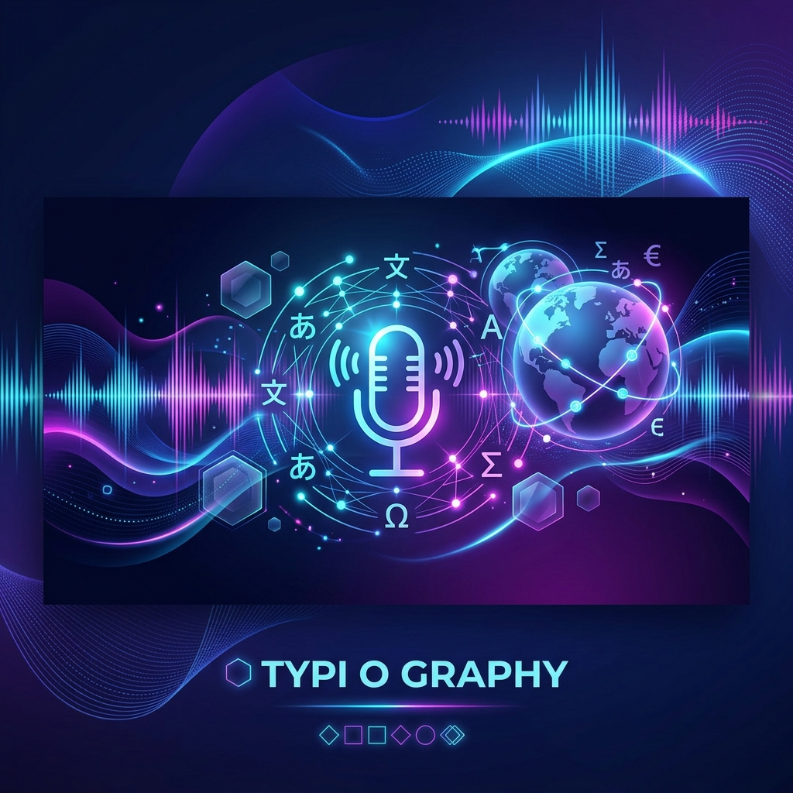

# RealtimeTranslator

**RealtimeTranslator** là một ứng dụng desktop mạnh mẽ giúp dịch thuật âm thanh thời gian thực, hỗ trợ dịch từ Microphone hoặc âm thanh hệ thống (System Audio/Loopback) với giao diện overlay hiện đại và khả năng tùy chỉnh cao.



## 🌟 Tính năng chính

- 🎙️ **Dịch đa nguồn**: Hỗ trợ lấy âm thanh từ Micro, System Audio (WASAPI Loopback) hoặc cả hai đồng thời.
- ⚡ **Nhận diện cực nhanh (STT)**: Sử dụng `faster-whisper` (local) hoặc OpenAI Whisper API để chuyển giọng nói thành văn bản với độ trễ cực thấp.
- 🤖 **Dịch thuật bằng AI (LLM)**: Tích hợp các mô hình ngôn ngữ lớn (Ollama, Groq, OpenAI, DeepSeek, SiliconCloud) để dịch thuật tự nhiên, đúng ngữ cảnh.
- 👥 **Phân biệt người nói (Speaker Diarization)**: Sử dụng `pyannote.audio` để nhận diện ai đang nói.
- 🎨 **Giao diện Overlay**: Cửa sổ trong suốt, luôn hiển thị trên cùng (Always-on-top), không viền, cho phép kéo thả và thay đổi kích thước linh hoạt.
- 📝 **Tính năng Rewrite**: Dịch lại toàn bộ bản ghi sau khi kết thúc với bộ thuật ngữ (Glossary) và hướng dẫn hiệu đính riêng.
- 📂 **Quản lý mô hình**: Tải và quản lý các mô hình Whisper ngay trong giao diện ứng dụng.
- 🔄 **Tự động cập nhật**: Thông báo và hỗ trợ cập nhật phiên bản mới trực tiếp từ GitHub.

## 🛠️ Công nghệ sử dụng

- **Ngôn ngữ**: Python 3.11+
- **Giao diện**: PyQt6
- **Xử lý âm thanh**: `sounddevice`, `pyaudiowpatch`
- **STT**: `faster-whisper`, `openai-whisper`
- **Translation**: `openai` SDK (tương thích với nhiều Provider)
- **Diarization**: `pyannote.audio`
- **Quản lý gói**: `uv`

## 🚀 Hướng dẫn cài đặt

### Cách 1: Dành cho người dùng (Bản đóng gói)

1. Tải bản mới nhất từ [GitHub Releases](https://github.com/haquanglap1/realtime-translator/releases).
2. Giải nén file zip.
3. Chạy `install.bat` để tự động thiết lập môi trường (chỉ cần làm lần đầu).
4. Cấu hình API Key trong `app/config/settings.yaml` (nếu dùng các dịch vụ online).
5. Chạy `run.bat` để bắt đầu sử dụng.

### Cách 2: Dành cho lập trình viên (Chạy từ Source Code)

Yêu cầu: Đã cài đặt [uv](https://docs.astral.sh/uv/).

```bash
# Clone dự án
git clone https://github.com/haquanglap1/realtime-translator.git
cd realtime-translator

# Cài đặt dependencies
uv sync

# Cấu hình file settings
cp config/settings.yaml.example config/settings.yaml
# Chỉnh sửa settings.yaml với API key của bạn

# Chạy ứng dụng
uv run python main.py
```

## ⚙️ Cấu hình cơ bản (settings.yaml)

Ứng dụng ưu tiên sử dụng `faster-whisper` cục bộ. Nếu bạn có GPU NVIDIA, hãy đảm bảo đã cài đặt CUDA để đạt hiệu suất tốt nhất.

```yaml
stt:
  engine: faster-whisper
  model: medium  # tiny, base, small, medium, large-v3
  device: cuda   # Hoặc cpu nếu không có GPU

llm:
  enabled: true
  provider: ollama # Hoặc groq, openai, deepseek...
  model: "qwen2.5:7b"
  target_language: Vietnamese
```

## 📖 Hướng dẫn sử dụng

1. **Chọn nguồn âm thanh**: Vào **STT Config** để chọn Mic hoặc Loopback (âm thanh từ Youtube, Zoom, Game...).
2. **Chọn Model**: Nếu chưa có model Whisper, vào **Models** để tải về.
3. **Bắt đầu**: Nhấn nút **Start** trên giao diện chính.
4. **Hiệu chỉnh**: Bạn có thể thay đổi độ trong suốt (A-/A+), kích thước chữ (T-/T+) ngay trên thanh công cụ.
5. **Dịch lại (Rewrite)**: Sau khi Stop, bạn có thể nhấn **Rewrite** để AI dịch lại toàn bộ hội thoại một cách mượt mà hơn dựa trên ngữ cảnh toàn bộ.

## 🗺️ Lộ trình phát triển (Roadmap)

- [x] Pipeline cơ bản STT -> Display
- [x] Tích hợp LLM Translation & Batching
- [x] Speaker Diarization
- [x] Tính năng Rewrite (Dịch lại toàn văn)
- [x] Quản lý mô hình trực quan
- [ ] Xuất file phụ đề (.srt)
- [ ] Giao diện người dùng cải tiến (Fluent Design)
- [ ] Hỗ trợ thêm nhiều Provider STT API

## 🤝 Đóng góp

Mọi sự đóng góp đều được trân trọng! Nếu bạn tìm thấy lỗi hoặc có ý tưởng mới, vui lòng mở một **Issue** hoặc gửi **Pull Request**.

## 📄 Giấy phép

Dự án này được phát hành dưới giấy phép MIT. Xem file `LICENSE` để biết thêm chi tiết.
